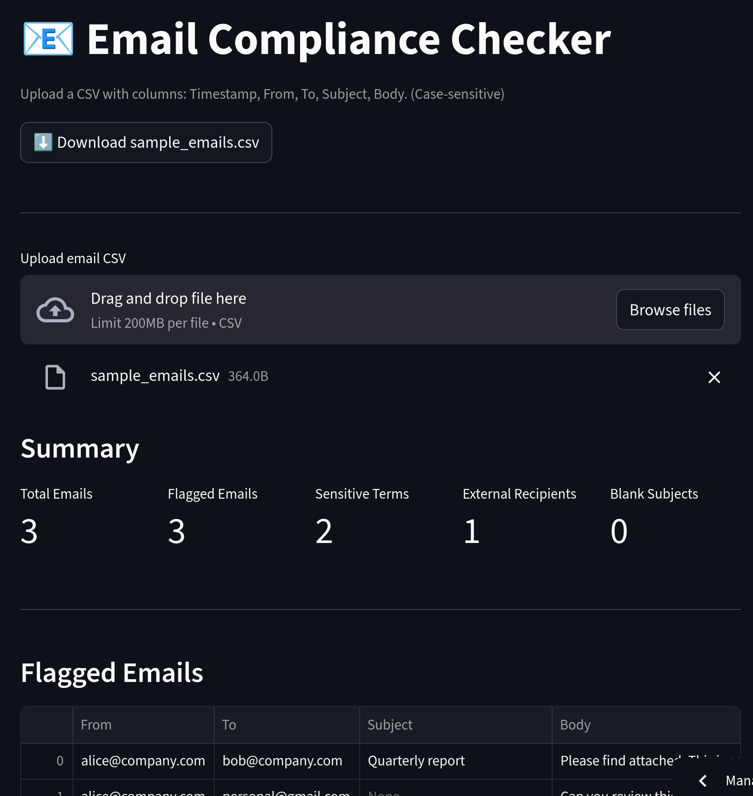

# 📧 Email Compliance Checker


Entry-level analysts are often asked to **triage shared-mailbox exports** (CSV) for risk—PII mentions, external recipients, blank subjects, etc. This tool shows you can take messy CSVs → **clear, auditable insights** that legal/compliance teams actually use.

---

## 🚀 What it does

* Upload a CSV of emails (**Timestamp, From, To, Subject, Body**)
* Flags:

  * **Sensitive terms** (e.g., “confidential”, “password”, “bank details”)
  * **External recipients** (e.g., `@gmail.com`, `@yahoo.com`, `@outlook.com`)
  * **Blank subject/body**
* Shows KPI cards + a **table of flagged messages**
* Download a sample CSV from the app to test instantly

---

## 📊 Example Output

<p align="center">
  
</p>

---

## 🧠 How it works (quick)

Core logic lives in `utils/parser.py`:

* `run_compliance_checks(df)` scans each row, tags issues, and returns:

  * `flagged_df` — rows with violations + “Flags” column
  * `stats` — counts for KPI cards
* Tweak rules by editing:

  * `SENSITIVE_TERMS = [...]`
  * `EXTERNAL_DOMAINS = [...]`

---

## Run the current demo on streamlit
https://email-compliance-checker.streamlit.app/

---

## 📦 Run locally

```bash
git clone https://github.com/Giuseppe552/email-compliance-checker.git
cd email-compliance-checker
python3 -m venv .venv && source .venv/bin/activate
pip install -r requirements.txt
streamlit run streamlit_app.py
```

**CSV schema (case-sensitive):**

```text
Timestamp, From, To, Subject, Body
```

Tip: Use the app’s **“Download sample\_emails.csv”** button to get a valid template.

---

## 🧩 Repo structure

```
email-compliance-checker/
├─ streamlit_app.py          # UI: upload → analyze → results
├─ utils/
│  ├─ __init__.py
│  └─ parser.py              # run_compliance_checks + rules
├─ data/
│  └─ sample_emails.csv      # (optional) example input
├─ docs/
│  └─ demo.png               # screenshot for README
├─ requirements.txt
└─ LICENSE
```

---

## ⚠️ Privacy

This tool analyzes text **client-side** in Streamlit. Don’t upload real confidential data to the public demo. For production, deploy inside the company network.

---

## License

MIT — free to use and extend. Contributions welcome!
